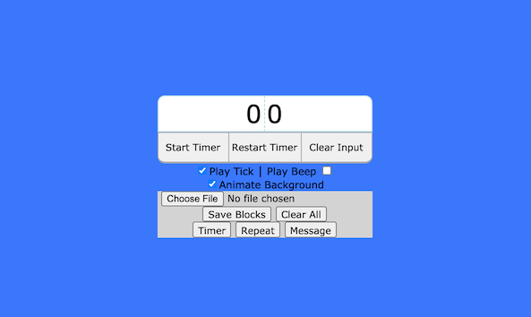
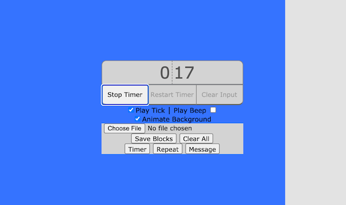
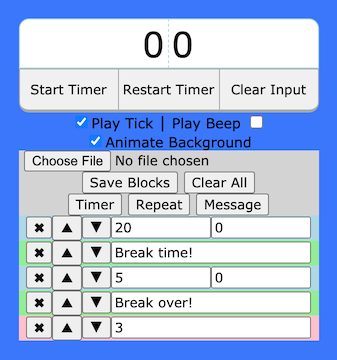

# Timer
Quickly set a timer and easily see how much time is left.


<br />

## Build
There's no prerequisite/installation. You can download this repo and open timer.html directly in your browser to run it.

<br />

## Usage
Type in a number for minutes (left side) and/or seconds (right side), and hit return. The timer will start counting down.

Here is a timer set for 20 seconds in the middle of counting down:


<br />

### Settings
| Setting            | Description                                                      |
|:-------------------|:-----------------------------------------------------------------|
| Play Tick          | Plays a ticking sound every second the timer is active.          |
| Play Beep          | Plays a looping beep at the end of the timer duration.           |
| Animate Background | Background slowly shrinks to represent what's left on the timer. |

<br />

### Scripted Timers

Make scripted timers using these "blocks". Each block will automatically run one after the other. 

Example below. This will run a timer for 20 minutes, followed by a message, then by a timer for 5 minutes, followed by another message, and finally these steps will be repeated 3 times.
<details>
    <summary>Click here to see the screenshot.</summary>
    
</details>

| Button  | Description                                                 |
|:--------|:------------------------------------------------------------|
| Timer   | When reached, sets the remaining time and starts the timer. |
| Repeat  | When reached, repeat the blocks above it.                   |
| Message | When reached, alerts the user with the message contents.    |

Choose ```Save Blocks``` to export the setup to a file. Upload this file to restore the setup.

<br />

## Credits
| Name            | Source                                                           | License                                                         | Notes                 |
|:----------------|:-----------------------------------------------------------------|:----------------------------------------------------------------|:----------------------|
| tick_normal.mp3 | [link](https://freesound.org/people/FoolBoyMedia/sounds/264498/) | [CC BY-NC 3.0](https://creativecommons.org/licenses/by-nc/3.0/) | Trimmed from original |
| tick.mp3        | same as above                                                    | same as above                                                   | Trimmed from original |
| beep.mp3        | [link](https://freesound.org/people/ZyryTSounds/sounds/219244/)  | [CC0 1.0](https://creativecommons.org/publicdomain/zero/1.0/)   | Trimmed from original |

<br />

## Changelog (last updated 2015/10/18)
- Add working countdown
- Add restart timer button
- Add clear timer input button
- Add styling
    - Add LCD font-family
- Add keybinds to start/stop
- Add notifications on timer end
- Add animated background
    - Add setting to enable/disable
- Add timer ticking sound and corresponding setting
- Fix sounds on Safari 5 (final version in 2013)
- Add end timer beep and corresponding setting
- Fix background not resetting to correct position
- Fix keybinds on Firefox
#### 19
- Formatting
#### 21
- Initial implementation of timer blocks
    - Allow moving blocks up/down without having to delete and recreate
#### 22
- Continue implementing timer blocks
    - Fix timer block's input validation
#### 23
- Add timer block message
#### 25
- Continue implementing timer blocks
    - Fix repeat not repeating the correct blocks
#### 27
- Add Clear All blocks button
- Add import/export for blocks
- Formatting
#### 29
- Fix notifications for message blocks
- Formatting
